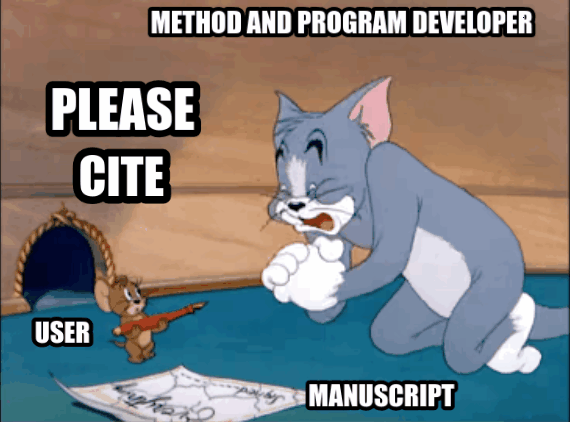

# Orbaplaw
> **Orb**ital **a**lignment analysis for **pla**ne **w**ave basis sets
> But now we are at the interlude of gaussian basis sets.

`Orbaplaw` can be used to perform
+ Population analysis
  + Lowin Population
+ Orbital localization
  + Pipek-Mezey localization
  + Foster-Boys localization
  + Fock space localization (Inefficiently implemented)
  + Localized orbitalet (Inefficiently implemented)
+ Inter-fragment bonding analysis
  + Principal interacting orbital (PIO) analysis
  + Natual fragment bond orbital (NFBO) analysis
  + Fragment-aligned molecular orbital (FAMO) analysis

## Documents

+ [Installation](doc/INSTALLATION.md)
+ [Wavefunction processing (Gaussian-based)](doc/WFN.md)
+ [Wavefunction processing (Plane-wave-based)](doc/PW.md)
+ [Natural atomic orbital](doc/NAO.md)
+ [Principal interacting orbital analysis](doc/PIO.md)
+ [Natural fragment bond orbital analysis](doc/NFBO.md)
+ [Fragment-aligned molecular orbital analysis](doc/FAMO.md)

## Citation
Zhang, Y. Orbaplaw: Orbital alignment analysis for plane wave basis sets. https://github.com/FreemanTheMaverick/Orbaplaw, 2024.

If `Orbaplaw` benefits your research, please cite this program and all the methods you use in your manuscript.

