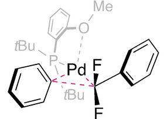

# Orbaplaw
Orbital alignment analysis for plane wave basis sets


## Contents
+ [Functions](#functions)

+ [Installation](#installation)

+ [Usage](#usage)

+ [Gallery](#gallery)
  + [Transition state of Diels-Alder reaction between dodecahexaene and ethene](#da)
  + [The delocalized σ bonds in [Zn<sub>3</sub>Cp<sub>3</sub>]<sup>+</sup> and [{Th(C<sub>8</sub>H<sub>8</sub>)Cl<sub>2</sub>}<sub>3</sub>]<sup>2-</sup>](#trimetal)
  + [The B<sub>19</sub><sup>-</sup> cluster: A 2-D three-layer model](#wankel)
  + [The tri-nuclear titanium polyhydride complex](#ti)
  + [The uranium-cyclobutadiene-uranium sandwich](#uu)
  + [d->π* weak interaction accelerating palladium-catalyzed cross-coupling aryldifluoromethylation](#pd)


## Functions
`Orbaplaw` can be used to perform
+ Population analysis
  + Lowin Population
+ Orbital localization
  + Pipek-Mezey localization
  + Fock space localization
  + Foster-Boys localization (under development)
  + Localized orbitalet (under development)
+ Inter-fragment bonding analysis
  + Principal interacting orbital (PIO) analysis,
  + Natual fragment bond orbital (NFBO) analysis,
  + Fragment-aligned molecular orbital (FAMO) analysis (under development).

## Installation
### Prerequisites
`Orbaplaw` is written in `Python 3` with several commonly used scientific computation packages.
Therefore, a recent distribution of `Anaconda` is all `Orbaplaw` needs.
### Download
+ `$ cd [Installation directory]`
+ `$ git clone https://github.com/FreemanTheMaverick/Orbaplaw.git`
### Environment variables
+ `$ vim ~/.bashrc`
+ Input the following texts to the end
  ```
  # Orbaplaw
  export PYTHONPATH=[Installation directory]/Orbaplaw:$PYTHONPATH
  ```
+ `$ source ~/.bashrc`


## Usage
Here is a typical procedure to perform NFBO analysis with `Orbaplaw`.
### *Ab initio* quantum chemistry computation
A single-configuration wavefunction given by an HF/DFT calculation is needed for NFBO analysis.
This can be done by a variety of computational chemistry packages.
Here we use `Gaussian 16` as an example.
```
%nprocshared=40
%mem=60GB
%chk=job.chk
# b3lyp 6-31g(d) 5d 7f

Title Card Required

0 1
......
```
NFBO analysis requires a basis set of natural atomic orbitals (NAOs).
In `Orbaplaw`, NAO construction is supported only for pure spherical gaussian basis functions, so the keyword `5d 7f` is necessary in the route section.
### Converting wavefunction file
The resultant wavefunction is stored in `job.chk`, an `chk` format file which is not supported by `Orbaplaw`.
We need to transform `job.chk` to `fchk` with `formchk` and then to `mwfn` format with `Multiwfn`.
```
$ formchk job.chk # Now we have job.fchk
$ Multiwfn job.fchk
100 # Other functions (Part 1)
2 # Export various files (mwfn/pdb/xyz/wfn/wfx/molden/fch/47/mkl...) or generate input file of quantum chemistry programs
32 # Output current wavefunction as .mwfn file
# Default name: job.mwfn
2 # Export wavefunction, density matrix and overlap matrix
0 # Return
q # Exit Multiwfn. Now we have job.mwfn
```
### Making a `Python` script for NFBO analysis
Here is an example `Python` script for NFBO analysis, named `job.py`.
```
from Orbaplaw import WaveFunction as wfn # Orbaplaw.WaveFunction is a subpackage for wavefunction file I/O.
from Orbaplaw import NaturalBondOrbitalMethods as nbo # Orbaplaw.NaturalBondOrbitalMethods is a subpackage for PIO and N(F)BO analysis.

frag1=[i for i in range(43)] # NFBO analysis needs the user to manually divide the molecule into fragments. In this example, we simply divide the molecule into two fragments.
frag2=[i for i in range(43,58)] # The first fragment covers Atoms 1-43 and the second 43-58. Note that indices start from 0 in Python.
mo=wfn.MultiWaveFunction("job.mwfn") # Reading the wavefunction stored in the file "job.mwfn" into a MultiWaveFunction object.
nao=nbo.NaturalAtomicOrbital(mo) # Transforming the wavefunction into NAO basis set.
nao.Export("job_nao.mwfn") # Exporting the NAOs to the file "job_nao.mwfn".
nfho,nfbo=nbo.NaturalBondOrbital(nao,frags=[frag1,frag2]) # Performing NFBO analysis based on the NAO-based wavefunction. Both NFHOs and NFBOs will be returned.
nfho.Export("job_nfho.mwfn") # Exporting the NFHOs and NFBOs into ".mwfn" file.
nfbo.Export("job_nfbo.mwfn")
```
Run the command `$ python job.py` and you will find the NFBO information printed on the screen, including the orbital indices, the population, the coefficients of NFHOs contributing to NFBOs and the fragments they belong to.
```
Fragment combination (0, 1)
NBO_109 (2.0)  =  0.265 * NHO_109 (0.141, F_0)  0.964 * NHO_110 (1.859, F_1)
NBO_110 (0.0)  =  -0.964 * NHO_109 (0.141, F_0)  0.265 * NHO_110 (1.859, F_1)
NBO_111 (2.0)  =  -0.899 * NHO_111 (1.615, F_0)  -0.438 * NHO_112 (0.385, F_1)
NBO_112 (0.0)  =  0.438 * NHO_111 (1.615, F_0)  -0.899 * NHO_112 (0.385, F_1)
```
You can view the orbitals (NAOs, NFHOs and NFBOs) in the ".mwfn" files with `Multiwfn`.


## Gallery
### <a id="da"></a> Transition state of Diels-Alder reaction between dodecahexaene and ethene
See [^nfbo].
### <a id="trimetal"></a> The delocalized σ bonds in [Zn<sub>3</sub>Cp<sub>3</sub>]<sup>+</sup> and [{Th(C<sub>8</sub>H<sub>8</sub>)Cl<sub>2</sub>}<sub>3</sub>]<sup>2-</sup>
See [^zn3cp3] [^th1] [^th2] [^th3] and [^nfbo].
### <a id="wankel"></a> The B<sub>19</sub><sup>-</sup> cluster: A 2-D three-layer model
See [^wankel1] [^wankel2] and [^nfbo].
### <a id="ti"></a> The tri-nuclear titanium polyhydride complex
Shima *et al.* achieved dinitrogen cleavage with a tri-nuclear titanium polyhydride complex.[^ti]
This complex consists of three [Ti-Cp'] motifs connected by six bridging hydrogen atoms and another hydrogen atom above the tri-nuclear plane.
When it comes to the electronic structure of this complex, however, the authors had difficulties in assigning the oxidation state of the titanium atoms.
The total charge of the ligands are ten, not divisible by three, the number of the titanium atoms.
As a result, one may have to make do with two titanium atoms with formal charge (III) and the other with (IV).
By NFBO analysis, we will show that there is actually one pair of electrons delocalized among the three titanium atoms, involving no ligands.
Seperating these two electrons from the two Ti(III) atoms, we have a normal three-Ti(IV) configuration.


*The structure of the tri-nuclear titanium polyhydride complex. The formal charge (IV) of one Ti atom different from (III) of the other two is not a typo.*

We simplify the model by replacing all the Cp' rings with unsubstituted Cp rings.
The *ab initio* computation is done at the level of B3LYP/6-31G(d) with `Gaussian 16`.
The three [Ti-Cp] motifs and the out-of-plane hydrogen atom are taken as four fragments.
Each pair of the remaining hydrogen atoms makes one fragment.
In total, there are seven fragments.
The occupation threshold is the default value, 1.9 per orbital.
NFBO analysis gives a result of six Ti-H<sub>μ2</sub>-Ti three-center bonds (each involving one bridging hydrogen atom and its two neighbouring titanium atoms), one Ti-Ti-Ti-H<sub>μ3</sub> four-center bond and one Ti-Ti-Ti three-center bond.
When assigning charges to the titanium atoms, one should consider the ten electrons by the ligands as well as the two electrons accommodated by the Ti-Ti-Ti three-center bond.
Therefore, each titanium atom has an oxidation state of (IV).


*One of the six Ti-H<sub>μ2</sub>-Ti three-center bonds*


*The Ti-Ti-Ti-H<sub>μ3</sub> four-center bond*


*The Ti-Ti-Ti three-center bond*

### <a id="uu"></a> The uranium-cyclobutadiene-uranium sandwich
In 2013, Patel *et al.* reported the synthesis of several complexes featuring a uranium-cyclobutadienyl/diphosphacyclobutadienyl-uranium sandwich structure.[^uu]
In this type of complexes, the cyclobutadienyl/diphosphacyclobutadienyl group lies between two uranium motifs.
Their molecular orbitals, however, are too delocalized and make the bonding schemes between the uranium motifs and the cyclobutadienyl/diphosphacyclobutadienyl group elusive.
Here we use our NFBO method to decipher the bonding schemes.


We choose the uranium-cyclobutadiene-uranium complex as an example and replace all the aromatic and methyl substituents with hydrogen atoms to simplify the model for shorter computation time.
The *ab initio* computation is done at the level of B3LYP/6-31G(d)+MWB60 with `Gaussian 16`.
The two uranium motifs and the middle cyclobutadiene are considered three fragments.


*NFBOs and NFHOs of one three-fragment bonds*


*NFBOs and NFHOs of the other three-fragment bonds*


### <a id="pd"></a> d->π* weak interaction accelerating palladium-catalyzed cross-coupling aryldifluoromethylation
In 2022, Choi *et al.* realized palladium-catalyzed aryldifluoromethylation of aryl halides with aryldifluoromethyl trimethylsilanes.[^pd]
It is found that this catalyzed reaction is orders of magnitude faster than similar reactions of analogous trifluoromethyl complexes.
The authors attribute this high reaction rate to the d(Pd)->π*(phenyl) weak interaction in the transition state of the reductive elimination step, which lowers the barrier.
Now we use NFBO to verify this statement.


*Transition state of the reductive elimination step*

The *ab initio* computation is done to the transition state at the level of B3LYP/6-31G(d)+MWB28 with `Gaussian 16`.
We consider the aryldifluoromethyl group as one fragment and everything else as the other fragment.
The occupation threshold is set to 1.95 per orbital.


*NFBOs and NFHOs of the transition state*
```
Fragment combination (0, 1)
NBO_129 (2.0)  =  -0.984 * NHO_129 (1.937, F_0)  -0.177 * NHO_130 (0.063, F_1)
NBO_130 (0.0)  =  0.177 * NHO_129 (1.937, F_0)  -0.984 * NHO_130 (0.063, F_1)
NBO_131 (2.0)  =  0.668 * NHO_131 (0.893, F_0)  0.744 * NHO_132 (1.107, F_1)
NBO_132 (0.0)  =  -0.744 * NHO_131 (0.893, F_0)  0.668 * NHO_132 (1.107, F_1)
```
NFBOs and NFHOs 131 and 132 correspond to the main interaction between the aryldifluoromethyl group and the phenyl ring activated by the Pd catalyst, a new C-C bond to be formed.
This interaction is simply covalent, featuring nearly equal coefficients and electron population of the two NFHOs.
NFBOs and NFHOs 129 and 130 correspond to the d(Pd)->π*(phenyl) interaction. NFHO 129, consisting of one of Pd's d orbitals, has a higher coefficient and a higher electron population in the bonding NFBO 129 than does NFHO 130, mainly one of the phenyl π* orbitals, which characterizes a weak dative interaction.

[^nfbo]: [This papar](https://doi.org/10.26434/chemrxiv-2024-rt585) elaborates on the concept of NFBO. It is written in a way as pedagogical as possible.
[^zn3cp3]: Freitag, K.; Gemel, C.; Jerabek, P.; Oppel, I. M.; Seidel, R. W.; Frenking, G.; Banh, H.;Dilchert, K.; Fischer, R. A. The σ-aromatic clusters [Zn<sub>3</sub>]<sup>+</sup> and [Zn<sub>2</sub>Cu]: Embryonic brass. *Angew. Chem. Int. Ed.* **2015**, *54*, 4370–4374. [link](https://onlinelibrary.wiley.com/doi/10.1002/anie.201410737)
[^th1]: Boronski, J. T.; Seed, J. A.; Hunger, D.; Woodward, A. W.; van Slageren, J.; Wooles, A. J.; Natrajan, L. S.; Kaltsoyannis, N.; Liddle, S. T. A crystalline tri-thorium cluster with σ-aromatic metal–metal bonding. *Nature* **2021**, *598*, 72–75. [link](https://doi.org/10.1038/s41586-021-03888-3)
[^th2]: Cuyacot, B. J. R.; Foroutan-Nejad, C. [{Th(C<sub>8</sub>H<sub>8</sub>)Cl<sub>2</sub>}<sub>3</sub>]<sup>2-</sup> is stable but not aromatic. *Nature* **2022**, *603*, E18–E20. [link](https://doi.org/10.1038/s41586-021-04319-z)
[^th3]: Boronski, J. T.; Seed, J. A.; Hunger, D.; Woodward, A. W.; van Slageren, J.; Wooles, A. J.; Natrajan, L. S.; Kaltsoyannis, N.; Liddle, S. T. Reply to: [{Th(C<sub>8</sub>H<sub>8</sub>)Cl<sub>2</sub>}<sub>3</sub>]<sup>2-</sup> is stable but not aromatic. *Nature* **2022**, *603*, E21–E22. [link](https://doi.org/10.1038/s41586-021-04320-6)
[^wankel1]: Huang, W.; Sergeeva, A. P.; Zhai, H.-J.; Averkiev, B. B.; Wang, L.-S.; Boldyrev, A. I. A concentric planar doubly π-aromatic B<sub>19</sub><sup>-</sup> cluster. *Nat. Chem.* **2010**, *2*, 202–206. [link](https://doi.org/10.1038/nchem.534)
[^wankel2]: Li, R.; You, X.-R.; Guo, J.-C.; Zhai, H.-J. Concentric inner 2π/6σ and outer 10π/14σ aromaticity underlies the dynamic structural fluxionality of planar B<sub>19</sub><sup>-</sup> Wankel motor cluster. *J. Phys. Chem. A* **2021**, *125*, 5022–5030. [link](https://doi.org/10.1021/acs.jpca.1c02764)
[^ti]: Shima, T.; Hu, S.; Luo, G.; Kang, X.; Luo, Y.; Hou, Z. Dinitrogen cleavage and hydrogenation by a trinuclear titanium polyhydride complex. *Science* **2013**, *340*, 1549–1552. [link](https://doi.org/10.1126/science.1238663)
[^uu]: Patel, D.; McMaster, J.; Lewis, W.; Blake, A. J.; Liddle, S. T. Reductive assembly of cyclobutadienyl and diphosphacyclobutadienyl rings at uranium. *Nat. Commun.* **2013**, *4*, 2323. [link](https://doi.org/10.1038/ncomms3323)
[^pd]: Choi, K.; Mormino, M. G.; Kalkman, E. D.; Park, J.; Hartwig, J. F. Palladium-catalyzed aryldifluoromethylation of aryl halides with aryldifluoromethyl trimethylsilanes. *Angew. Chem. Int. Ed.* **2022**, *61*, e202208204. [link](https://doi.org/10.1002/anie.202208204)
