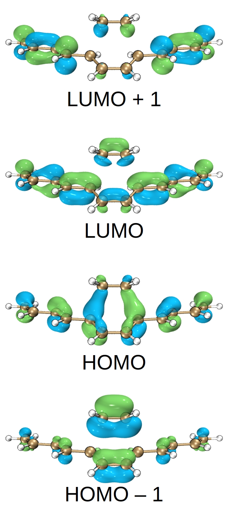
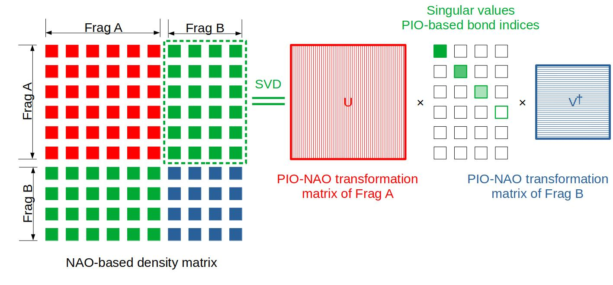
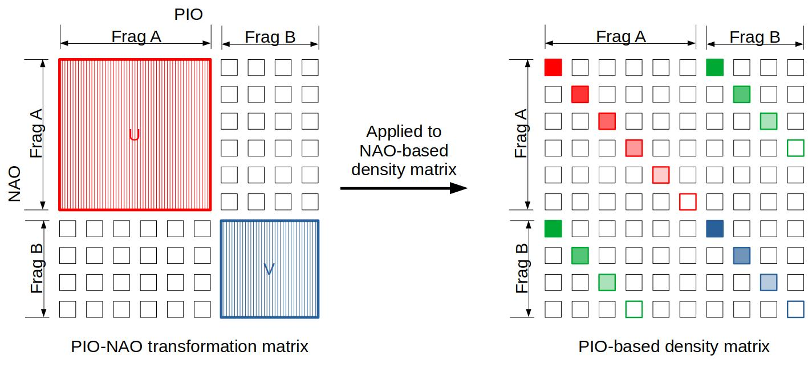
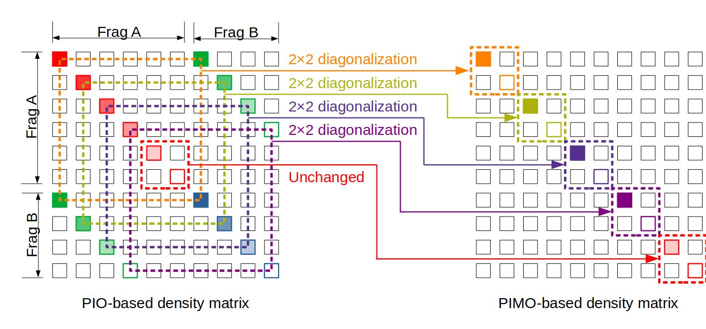

# Principal interacting orbital
Unravelling principal bonding interactions between two fragments

## Contents
+ [Theory](#theory)
+ [Usage](#usage)
+ [Gallery](#gallery)

## Theory
We are often caught in a scenario, where the investigated bonding interaction between two fragments cannot be efficiently illustrated by CMOs.
One example is the transition state of the Diels-Alder reaction between largely conjugated systems.
Undergraduate chemistry knowledge tells us that only the HOMOs and LUMOs of the diene and the dienophile interacts with each other, so only four CMOs (two occupied plus two virtual) matters.
However, in this example, the frontier orbitals of the reaction site are heavily contaminated by the rest of the π conjugated system.
Besides, there are many non-frontier CMOs that partially show the inter-fragment interaction.
This does not mean that there are more bonding interactions of D-A reactions of largely conjugated systems than those of less conjugated ones.
Rather, in largely conjugated systems, the feature of the two pairs of typical HOMO-LUMO interactions between the diene and the dienophile are "delocalized" among several CMOs.

*The frontier CMOs of the transition state of the D-A reaction between dodecahexaene and ethene.
The π orbitals of the reaction site are heavily contaminated by the rest of the conjugated system.
In addition, there are actually more CMOs that partially reflect the interaction between the diene and the dienophile but are not shown here.*

How can we localize them back into their typical form with only two orbitals?
Our principal interacting orbital method offers an solution based on principal component analysis of the off-diagonal blocks of the NAO-based density matrix.
Here we will elaborate on how it works.

The key is finding the representation of the inter-fragment interaction.
We know that in a density matrix, the diagonal elements indicate the "population" of bases and the off-diagonal elements indicate the "interaction" between pairs of bases.
Similarly, if we put bases into groups by the atoms they come from, the diagonal blocks indicate the "population" of atoms and the off-diagonal blocks indicate the "interaction" between pairs of atoms.
Again, if we put bases into groups by the fragments they come from, the diagonal blocks indicate the "population" of fragments and the off-diagonal blocks indicate the "interaction" between pairs of fragments.
Therefore, we will pay special attention to the off-diagonal block of the density matrx.
In our implementation, the density matrix is based on natural atomic orbitals (NAOs), since they reflect the electronic structures of atoms in the molecular environment and are orthogonal.
Besides, we assume that the investigated molecule is divided into two fragments, A and B.

Now we want to transform the NAO basis set so that each interaction involves only one pair of orbitals, one from A and the other one from B.
In other words, we want to find a transformation of the NAO basis set that leaves only one non-zero value in each row and each column of the off-diagonal block.
That can be done by singular value decomposition (SVD) of the diagonal block.
The two transformation matrices obtained are for the NAOs of A and B, respectively.
The resulted orbitals are called principal interacting orbitals (PIOs), because the forementioned procedure originates from the idea of principal component analysis.
The singular values indicate the strengths of the interactions, ranging in $$$(0,1)$$$, so they are called PIO-based bond indices (PBIs).
Theoretically, the number of the interactions equals that of the [NAOs](NAO.md) of the smaller fragment (with fewer NAOs than the bigger fragment).
However, most of them have negligible PBIs and thus can be safely ignored; only the few with large PBIs matter.

Next, we project the NAO-based density matrix onto the PIO basis set by applying the two forementioned transformation matrix.
The resulted PIO-based density matrix, like the NAO-based one, has four blocks, two intra-fragment blocks (diagonal) and two inter-fragment ones (off-diagonal, conjugate transpose to each other).
It can be shown that they are all diagonalized.

The final step is diagonalizing the PIO-based density matrix to find the interactions between pairs of PIOs from different fragments.
This is equivalent to separately diagonalizing the 2-by-2 subblocks constructed by non-zero elements sharing the same row or column indices.
Each pair of eigenvectors, called principal interacting molecular orbitals (PIMOs), illustrate the bonding and anti-bonding features of one interaction between the two fragments.
The two eigenvalues are 1 for bonding and 0 for anti-bonding.
Some elements of the bigger fragment (with more NAOs than the smaller one) are left unchanged.
They correspond to the PIOs of the bigger fragment that have no bonding interaction with any PIOs of the smaller fragment.

In this way, we can see the principal interactions between the two fragments free of contamination caused by the substitution groups.

## Usage

+ Loading necessary modules.
```
from Orbaplaw import WaveFunction as wfn
from Orbaplaw import NaturalBondOrbitalMethods as nbo
```

+ Loading the `mwfn` file.
```
mo=wfn.MultiWaveFunction("job.mwfn")
```

+ Generating NAOs.

NFBO analysis requires a basis set of natural atomic orbitals (NAOs).
Read [NAO.md](NAO.md) for more information about this part.
```
nao=nbo.NaturalAtomicOrbital(mo)
nao.Export("job_nao.mwfn")
```

+ Defining the fragments.

PIO analysis needs the user to manually divide the molecule into fragments.
In this example, we simply divide the molecule into two fragments.
The first fragment covers Atoms 1-42 and the second 43-58.
Note that indices start from 0 in Python.
```
frag1=[i for i in range(43)]
frag2=[i for i in range(43,58)]
```

+ Conducting PIO analysis.

Both NFBOs and NFHOs are exported.
```
pio,pimo=nbo.PrincipalInteractingOrbital(nao,[frag1,frag2])
pio.Export("job_pio.mwfn")
pimo.Export("job_pimo.mwfn")
```

+ Reading the results.

You will find the PIO/PIMO information printed on the screen, including the orbital indices, the populations, the PBIs and the coefficients of PIOs contributing to PIMOs.
```
PIMO_0 (2.0, 0.584) =  0.421 * PIO_0 (0.355)  0.907 * PIO_1 (1.645)
PIMO_1 (-0.0, 0.584) =  -0.907 * PIO_0 (0.355)  0.421 * PIO_1 (1.645)
PIMO_2 (2.0, 0.537) =  -0.917 * PIO_2 (1.68)  -0.4 * PIO_3 (0.32)
PIMO_3 (-0.0, 0.537) =  0.4 * PIO_2 (1.68)  -0.917 * PIO_3 (0.32)
```

# Gallery
[^pio1][^pio2][^pio3][^pio4][^pio5][^pio6]

[^pio1]: Zhang, J.-X.; Sheong, F. K.; Lin, Z. Unravelling chemical interactions with principal interacting orbital analysis. *Chem. Eur. J.* **2018**, *24*, 9639–9650. [link](https://doi.org/10.1002/chem.201801220)
[^pio2]: Sheong, F. K.; Zhang, J.-X.; Lin, Z. Principal interacting spin orbital: Understanding the fragment interactions in open-shell systems. *Phys. Chem. Chem. Phys.* **2020**, *22*, 10076–10086. [link](https://doi.org/10.1039/D0CP00127A)
[^pio3]: Zhang, J.-X.; Sheong, F. K.; Lin, Z. Principal interacting orbital: A chemically intuitive method for deciphering bonding interaction. *WIREs Comput. Mol. Sci.* **2020**, *10*, e1469. [link](https://doi.org/10.1002/wcms.1469)
[^pio4]: Sheong, F. K.; Chen, W.-J.; Zhang, J.-X.; Li, Y.; Lin, Z. Structure and bonding of \[Pd<sub>2</sub>Sn<sub>18</sub>\]<sup>4–</sup>: An interesting example of the mutual delocalisation phenomenon. *Dalton Trans.* **2017**, *46*, 2214–2219. [link](https://doi.org/10.1039/C6DT04561H)
[^pio5]: Zhang, J.-X.; Sheong, F. K.; Lin, Z. Remote bonding in clusters \[Pd<sub>3</sub>Ge<sub>18</sub>R<sub>6</sub>\]<sup>2–</sup>: Modular bonding model for large clusters via principal interacting orbital analysis. *Inorg. Chem.* **2019**, *58*, 3473–3478. [link](https://doi.org/10.1021/acs.inorgchem.8b03640)
[^pio6]: Sheong, F. K.; Zhang, J.-X.; Lin, Z. Modular bonding picture for aromatic borometallic molecular wheels. *Theor. Chem. Acc.* **2020**, *139*, 14. [link](https://doi.org/10.1007/s00214-019-2536-9)
